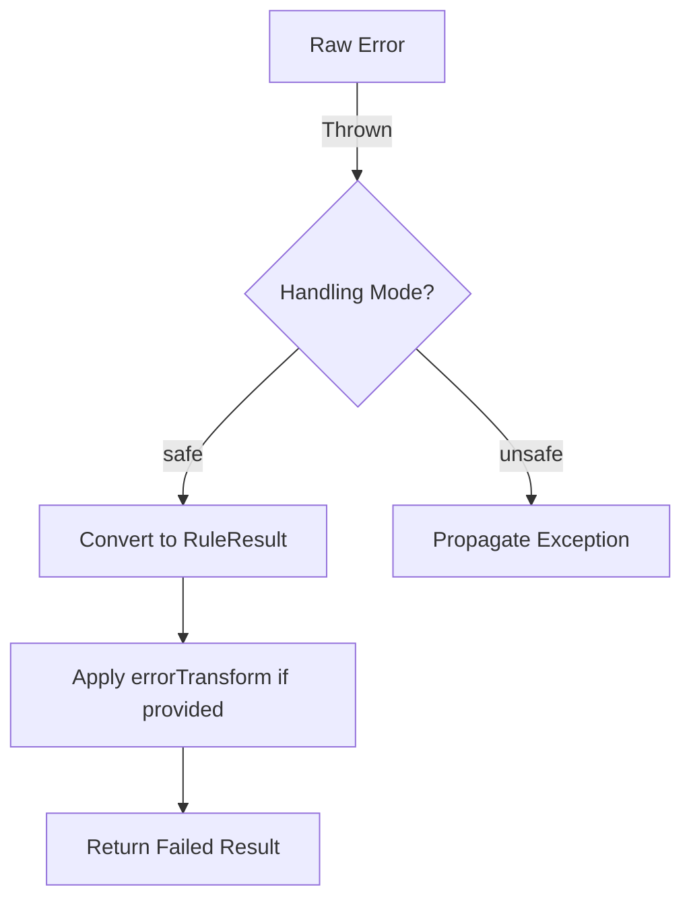
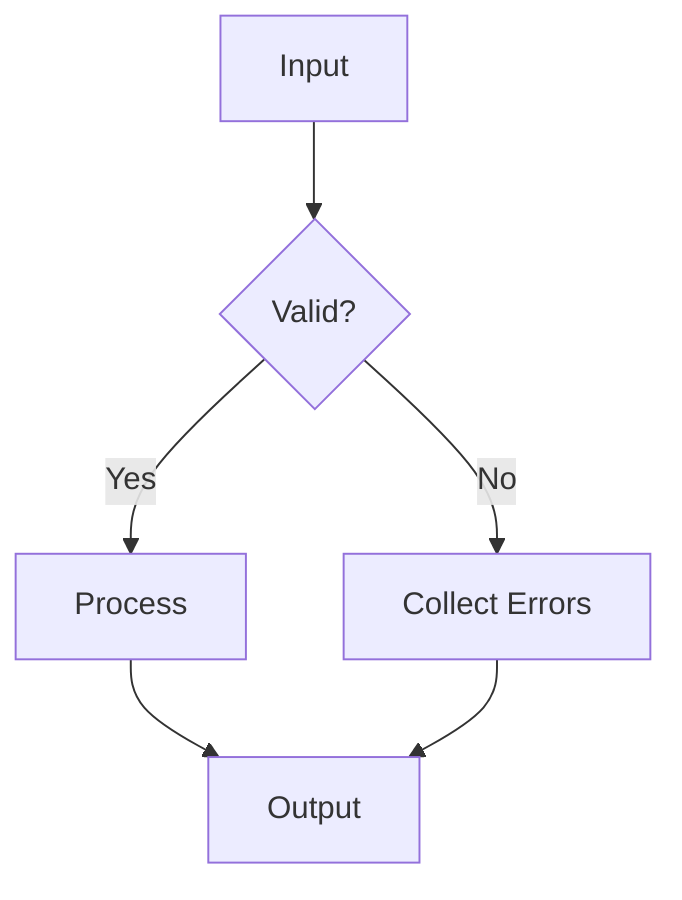

# TS Rules Composer 🎼

[](https://npmjs.com/package/ts-rules-composer)
[](https://bundlephobia.com/package/ts-rules-composer)
[](LICENSE)

A **dependency-free**, type-safe validation engine for composing complex business rules with elegant pipelines.

```typescript
// Example: E-commerce checkout
const validateCheckout = pipeRules([
  validateCart,
  match((order) => order.paymentMethod, {
    'credit_card': validateCreditCard,
    'paypal': validatePaypal
  }),
  withRetry(validateInventory, { attempts: 3 })
]);

const result = await validateCheckout(order);
```

## Features ✨

- 🧩 **Composable** - Build pipelines with 25+ combinators (`when`, `unless`, `mapError`, etc.)
- 🚀 **Zero Dependencies** - Lightweight (under 2KB gzipped)
- 🦾 **TypeScript First** - Full inference for inputs, contexts, and errors
- ⏱ **Async Ready** - Mix sync/async rules seamlessly
- 🛡 **Context-Aware** - Shared validation state
- 🔌 **Extensible** - Easily create custom combinators that integrate seamlessly
- 📊 **Instrumentation** - Debugging & metrics out-of-the-box
- 🧪 **Rigorously Tested** - 100% test coverage with 300+ test cases covering all edge cases

## Installation

```bash
npm install ts-rules-composer
# or
yarn add ts-rules-composer
# or
pnpm add ts-rules-composer
```

## Core Concepts

### 1. Rules

The atomic validation unit:

```typescript
type Rule<TInput, TError = string, TContext = unknown> = (
  input: TInput,
  context?: TContext
) => Promise<RuleResult<TError>> | RuleResult<TError>;
```

### 2. Results

Always returns:

```typescript
type RuleResult<TError> =
  | { readonly status: "passed" }
  | { readonly status: "failed"; readonly error: TError };
```

## Usage Examples

### Example 1: Financial Transaction Validation

```typescript
import {
  pipeRules,
  match,
  withRetry,
  withMemoize,
  withTimeout,
  when
} from 'ts-rules-composer';

// 1. Basic validators
const validateAmount = (tx: Transaction) =>
  tx.amount > 0 ? pass() : fail("Amount must be positive");

const validateCurrency = (tx: Transaction) =>
  SUPPORTED_CURRENCIES.includes(tx.currency)
    ? pass()
    : fail(`Unsupported currency: ${tx.currency}`);

// 2. Memoized fraud check (cached for 5 minutes)
const checkFraudRisk = withMemoize(
  async (tx: Transaction) => {
    const risk = await fraudService.assess(tx);
    return risk.score < 5 ? pass() : fail("High fraud risk");
  },
  tx => `${tx.userId}-${tx.amount}-${tx.recipient}`,
  { ttl: 300000 }
);

// 3. Payment method handling
const validatePaymentMethod = match(
  tx => tx.paymentType,
  {
    "credit_card": pipeRules([
      validateCardNumber,
      validateExpiry,
      withTimeout(bankAuthCheck, 3000, "Bank auth timeout")
    ]),
    "crypto": validateWalletAddress,
    "bank_transfer": validateIBAN
  }
);

// 4. Complete pipeline
const validateTransaction = pipeRules([
  validateAmount,
  validateCurrency,
  
  // Only run fraud check for transactions > $1000
  when(
    tx => tx.amount > 1000,
    withRetry(checkFraudRisk, { attempts: 2 })
  ),
  
  validatePaymentMethod,
  
  // Compliance check (different for business/personal)
  match(
    tx => tx.accountType,
    {
      "business": validateBusinessTransfer,
      "personal": validatePersonalTransfer
    }
  )
]);

// Usage
const result = await validateTransaction(paymentRequest, {
  userKycStatus: await getKycStatus(userId)
});
```

### Example 2: User Registration

```typescript
import { pipeRules, every, match, withMetrics } from 'ts-rules-composer';

const validateUser = pipeRules([
  // Sequential validation
  validateUsernameFormat,
  withMemoize(checkUsernameAvailability, { ttl: 60000 }),
  
  // Parallel validation
  every([
    validatePasswordStrength,
    validateEmailFormat,
    checkEmailUnique
  ]),
  
  // pattern matching routing
  match(
    user => user.role,
    {
      'admin': validateAdminPrivileges,
      'user': validateStandardUser
    },
    fail('Unknown role')
  )
]);

// With instrumentation
const instrumentedValidation = withMetrics(validateUser, {
  onEnd: (result) => trackAnalytics(result)
});
```

### Example 3: Healthcare Appointment System

```typescript
const bookAppointment = pipeRules([
  // Context-aware validation
  requireContextRule(
    "Missing schedule data",
    (appt, ctx: ScheduleContext) => validateDoctorAvailability(appt, ctx)
  ),
  
  // Error transformation
  mapError(
    validateInsurance,
    error => `Insurance error: ${error.code}`
  ),
  
  // Time-sensitive check
  withTimeout(
    checkFacilityCapacity,
    5000,
    "System timeout"
  )
]);

// Usage
const result = await bookAppointment(newAppointment, clinicSchedule);
```

### Example 4: Content Moderation System

```typescript
import { 
  pipeRules,
  validateField,
  requireContextRule,
  inject,
  tap
} from 'ts-rules-composer';

// 1. Strongly typed context
type ModerationContext = {
  moderatorId: string;
  permissions: string[];
  environment: 'staging' | 'production';
};

// 2. Rule factory with dependency injection
const createModerationRules = (logger: LoggerService) => 
  pipeRules([
    // Enforce context requirements
    requireContextRule(
      "Moderator context required",
      (post, ctx: ModerationContext) => pipeRules([
        
        // Core validations
        validateField(post => post.content, content => 
          content.length > 0 || fail("Empty content")
        ),
        
        // Environment-specific rule
        when(
          (_, ctx) => ctx.environment === 'production',
          validateField(post => post.tags, tags =>
            tags.length <= 5 || fail("Too many tags")
          )
        ),

        // Permission-based rule
        when(
          (_, ctx) => ctx.permissions.includes('FLAG_SENSITIVE'),
          validateField(post => post.content, checkSensitiveContent)
        ),

        // Logging side effect
        tap((post, ctx) => {
          logger.log({
            action: 'moderate',
            moderator: ctx.moderatorId,
            postId: post.id
          });
        })
      ])
    )
  ]);

// 3. Inject dependencies
const moderatePost = inject(
  { logger: new Logger() },
  createModerationRules
);

// 4. Usage
const postModerationResult = await moderatePost(
  { id: "post123", content: "Hello", tags: ["a"] },
  { 
    moderatorId: "user456", 
    permissions: ["FLAG_SENSITIVE"],
    environment: "production"
  }
);
```

## Error Handling Standardization

This library provides consistent error handling across all validation operations through a standardized system:

### Core Principles

1. **No Uncaught Exceptions** - All errors are converted to `RuleResult` objects
2. **Type Safety** - Custom error types are preserved throughout operations
3. **Flexible Control** - Choose between safety and performance with error handling modes

### Standardization Functions

| Function                | Purpose                                                                 |
|-------------------------|-------------------------------------------------------------------------|
| `withSafeError`         | Wraps rules to catch exceptions and convert to failed validation results|
| `withSafePredicate`     | Safely handles predicate functions that may throw                       |
| `getNormalizedRule`     | Applies consistent error handling to single rules                       |
| `getNormalizedRules`    | Batch processes multiple rules with standardized error handling         |

### Error Handling Modes

Configure via `RuleSafetyOptions`:

```typescript
{
  errorHandlingMode?: 'safe' | 'unsafe',  // Default: 'safe'
  errorTransform?: (error: unknown) => TError // Custom error conversion
}
```

**Modes**:

- `safe`: (Default) All errors are caught and converted to validation failures
- `unsafe`: Lets exceptions propagate (for performance-critical paths)

### Error Flow



### Best Practices

1. **For validation logic**:

   ```typescript
   // Safe mode with custom error transformation
   const rule = getNormalizedRule(myRule, {
     errorTransform: (e) => ({ code: 500, message: String(e) })
   });
   ```

2. **For performance-critical paths**:

   ```typescript
   // Unsafe mode - ensure calling code handles exceptions
   const fastRule = getNormalizedRule(highPerfRule, {
     errorHandlingMode: 'unsafe'
   });
   ```

3. **Custom error types**:

   ```typescript
   type APIError = { status: number };
   const apiRule: Rule<string, APIError> = /*...*/;
   // Preserves APIError type through all transformations
   ```

### Debugging Tips

Enable debug mode to get enhanced error information:

```typescript
import { withDebug } from './combinators';

const debugRule = withDebug(myRule, {
  onError: (error) => console.error('Rule failed:', error)
});
```

## Context Cloning Options

The library provides flexible context cloning strategies to balance between performance and correctness. You can control cloning behavior through `CompositionOptions`:

```typescript
interface CompositionOptions {
  cloneContext?: boolean;      // Enable/disable cloning
  shallowClone?: boolean;      // Use shallow clone when true
  structuredClone?: boolean;   // Force structuredClone when true
}
```

### Cloning Strategies

The library automatically selects the best available cloning method based on your options and runtime environment:

| Option            | Priority | Speed  | Depth | Special Types* | Circular Refs | Node.js | Browser |
|-------------------|----------|--------|-------|----------------|---------------|---------|---------|
| `shallowClone`    | 1st      | 🚀 Fast | Shallow | ❌ No         | ✅ Yes        | ✅      | ✅      |
| `structuredClone` | 2nd      | 🐢 Slow | Deep  | ✅ Yes         | ✅ Yes        | 17+     | Modern  |
| JSON Clone        | Fallback | 🏎 Fast | Deep  | ❌ No          | ❌ No         | ✅      | ✅      |

*Special Types: Date, Map, Set, RegExp, etc.

### Usage Examples

**1. Default Behavior (Smart Auto-Detect)**

```typescript
// Automatically uses the best available clone method
pipeRules(rules, { cloneContext: true })
```

**2. Force Shallow Clone**

```typescript
// Fastest option - only clones top-level properties
pipeRules(rules, { cloneContext: true, shallowClone: true })
```

**3. Force Structured Clone**

```typescript
// Most accurate - preserves special object types
pipeRules(rules, { cloneContext: true, structuredClone: true })
// Falls back to JSON clone if structuredClone isn't available
```

## API Reference

### Core Functions

#### `pipeRules(rules, options?)`  

Sequentially executes rules left-to-right (fails fast)  

```typescript
const validateUser = pipeRules([
  validateEmailFormat,
  checkEmailUnique,
  validatePassword
], { cloneContext: true })
```

#### `composeRules(rules, options?)`  

Sequentially executes rules right-to-left (fails fast)  

```typescript
const processInput = composeRules([
  normalizeData,
  validateInput,
  sanitizeInput
])
```

#### `every(rules, options?)`  

Runs rules in parallel (collects all errors)  

```typescript
const validateProfile = every([
  validateAvatar,
  validateBio,
  validateLinks
])
```

### Control Flow

#### `match(accessor, cases, defaultCase?)`  

Pattern matching routing

```typescript
const validatePayment = match(
  order => order.payment.type,
  {
    credit: validateCreditCard,
    paypal: validatePaypal,
    crypto: validateCrypto
  },
  fail("Unsupported payment method")
)
```

#### `when(condition, rule)`  

Executes only if condition is true  

```typescript
const validateAdmin = when(
  user => user.role === "admin",
  checkAdminPrivileges
)
```

#### `unless(condition, rule)`  

Executes only if condition is false  

```typescript
const validateGuest = unless(
  user => user.isVerified,
  requireVerification
)
```

#### `ifElse(condition, ifRule, elseRule?)`  

Branch between two rules  

```typescript
const validateAge = ifElse(
  user => user.age >= 18,
  validateAdult,
  validateMinor
)
```

#### `oneOf(...rules)`  

Tries rules until one passes  

```typescript
const validateContact = oneOf(
  validateEmail,
  validatePhone,
  validateUsername
)
```

#### `withFallback(mainRule, fallbackRule, options?)`  

Fallback when main rule fails  

```typescript
const validateWithFallback = withFallback(
  primaryValidation,
  backupValidation
)
```

### Error Handling

#### `mapError(rule, transform)`  

Transforms error output  

```typescript
const friendlyErrors = mapError(
  validatePassword,
  err => `Security error: ${err}`
)
```

#### `not(rule, error)`  

Inverts rule logic  

```typescript
const isNotBanned = not(
  checkBanStatus,
  "Account must be active"
)
```

### Performance

#### `withMemoize(rule, keyFn, options?)`  

Caches rule results  

```typescript
const cachedCheck = withMemoize(
  dbUserLookup,
  user => user.id,
  { ttl: 30000, maxSize: 100 }
)
```

#### `withTimeout(rule, ms, timeoutError)`  

Adds execution timeout  

```typescript
const timeboundRule = withTimeout(
  apiCheck,
  3000,
  "Request timed out"
)
```

#### `withRetry(rule, options)`  

Automatic retries on failure  

```typescript
const resilientRule = withRetry(
  flakyServiceCheck,
  { attempts: 3, delayMs: 1000 }
)
```

### Context Management

#### `requireContextRule(error, rule, typeGuard?)`  

Enforces context requirements  

```typescript
const authRule = requireContextRule(
  "Authentication required",
  (input, ctx: AuthContext) => checkPermissions(ctx.token),
  (ctx): ctx is AuthContext => !!ctx?.token
)
```

#### `withLazyContext(loader, rule)`  

Lazy-loads context  

```typescript
const profileRule = withLazyContext(
  userId => fetchProfile(userId),
  validateProfile
)
```

#### `hasContext(ctx)`  

Type guard for context  

```typescript
if (hasContext<AuthContext>(context)) {
  // context is now typed as AuthContext
}
```

### Instrumentation

#### `withDebug(rule, options)`  

Adds debug logging  

```typescript
const debugRule = withDebug(validateOrder, {
  name: "OrderValidation",
  onEnd: (input, result) => console.log(result)
})
```

#### `tap(effect)`  

Performs side effects  

```typescript
const loggedRule = tap((input, result) => {
  analytics.trackValidation(input, result)
})
```

### Utilities

#### `pass()`  

Creates success result  

```typescript
const success = pass()
```

#### `fail(error)`  

Creates failure result  

```typescript
const failure = fail("Invalid input")
```

#### `getRuleError(result)`  

Extracts error from failed result  

```typescript
if (result.status === "failed") {
  const error = getRuleError(result)
}
```

#### `validateField(getter, rule, defaultValue?)`  

Validates object fields  

```typescript
const validateEmail = validateField(
  user => user.email,
  validateEmailFormat
)
```

#### `inject(dependency, ruleFactory)`  

Dependency injection  

```typescript
const createDbRule = (db: Database) => (input: string) =>
  db.exists(input) ? pass() : fail("Not found")

const dbRule = inject(database, createDbRule)
```

### Core Functions

| Function | Description | Example |
|----------|-------------|---------|
| `pipeRules` | Sequential validation left-right (fail-fast) | `pipeRules([checkA, checkB])` |
| `composeRules` | Sequential validation right-left (fail-fast) | `composeRules([checkA, checkB])` |
| `every` | Parallel validation (collect all errors) | `every([checkX, checkY])` |
| `match` | Pattern matching routing | `match(getUserType, { admin: ruleA, user: ruleB })` |
| `ifElse` | Conditional routing | `ifElse(isUnderAge, validateMinorAccount, validateAdultAccount)` |

### Combinators

| Combinator | Purpose | Example |
|------------|---------|---------|
| `when` | Conditional execution | `when(isAdmin, validateAdmin)` |
| `unless` | Negative condition | `unless(isGuest, validateAccount)` |
| `not` | Invert rule logic | `not(isBanned, "Must not be banned")` |
| `oneOf` | First-successful validation | `oneOf(validateV1, validateV2)` |
| `withFallback` | Fallback rule | `withFallback(primary, backup)` |

### Performance

| Utility | Use Case | Example |
|---------|----------|---------|
| `withMemoize` | Cache results | `withMemoize(expensiveCheck, { ttl: 30000 })` |
| `withTimeout` | Add time limit | `withTimeout(networkCall, 3000, "Timeout")` |
| `withRetry` | Automatic retries | `withRetry(unstableAPI, { attempts: 3 })` |

### Instrumentation

| Tool | Purpose | Example |
|------|---------|---------|
| `withDebug` | Debug logging | `withDebug(rule, { name: "Validation" })` |
| `tap` | Side effects | `tap((input, result) => log(result))` |

## Best Practices

1. **Small Rules** - Keep each rule focused
2. **Pure Functions** - Avoid side effects in rules
3. **Memoize** - Cache expensive validations
4. **Type Narrowing** - Use `requireContextRule` for safety
5. **Instrument** - Add metrics in production



## Contributing

1. Fork the repository
2. Create a feature branch (`git checkout -b feat/amazing-feature`)
3. Commit changes (`git commit -m 'Add amazing feature'`)
4. Push to branch (`git push origin feat/amazing-feature`)
5. Open a Pull Request

## License

MIT © Breno Magalhães  
**Like this project?** ⭐️ [Star it on GitHub](https://github.com/Brenopms/ts-rules-composer)
