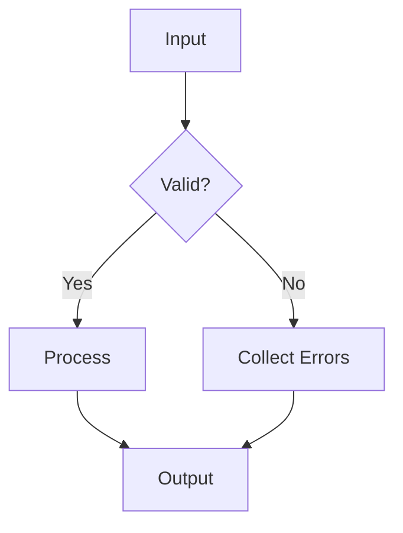

# TS Rules Composer 🎼

[](https://npmjs.com/package/ts-rules-composer)
[](https://bundlephobia.com/package/ts-rules-composer)
[](LICENSE)

A **dependency-free**, type-safe validation engine for composing complex business rules with elegant pipelines.

```typescript
// Example: E-commerce checkout
const validateCheckout = composeRules([
  validateCart,
  match(paymentMethod, {
    'credit_card': validateCreditCard,
    'paypal': validatePaypal
  }),
  withRetry(validateInventory, { attempts: 3 })
]);

const result = await validateCheckout(order);
```

## Features ✨

- 🧩 **Composable** - Build pipelines with 25+ combinators (`when`, `unless`, `mapError`, etc.)
- 🚀 **Zero Dependencies** - Lightweight (under 5KB gzipped)
- 🔌 **TypeScript First** - Full inference for inputs, contexts, and errors
- ⏱ **Async Ready** - Mix sync/async rules seamlessly
- 🛡 **Context-Aware** - Shared validation state
- 📊 **Instrumentation** - Debugging & metrics out-of-the-box

## Installation

```bash
npm install ts-rules-composer
# or
yarn add ts-rules-composer
# or
pnpm add ts-rules-composer
```

## Core Concepts

### 1. Rules

The atomic validation unit:

```typescript
type Rule<TInput, TError = string, TContext = unknown> = (
  input: TInput,
  context?: TContext
) => Promise<RuleResult<TError>> | RuleResult<TError>;
```

### 2. Results

Always returns:

```typescript
type RuleResult<TError> =
  | { readonly status: "passed" }
  | { readonly status: "failed"; readonly error: TError };
```

## Usage Examples

### Example 1: Financial Transaction Validation

```typescript
import {
  composeRules,
  branch,
  withRetry,
  memoizeRule,
  withTimeout,
  when
} from 'ts-rules-composer';

// 1. Basic validators
const validateAmount = (tx: Transaction) =>
  tx.amount > 0 ? pass() : fail("Amount must be positive");

const validateCurrency = (tx: Transaction) =>
  SUPPORTED_CURRENCIES.includes(tx.currency)
    ? pass()
    : fail(`Unsupported currency: ${tx.currency}`);

// 2. Memoized fraud check (cached for 5 minutes)
const checkFraudRisk = memoizeRule(
  async (tx: Transaction) => {
    const risk = await fraudService.assess(tx);
    return risk.score < 5 ? pass() : fail("High fraud risk");
  },
  tx => `${tx.userId}-${tx.amount}-${tx.recipient}`,
  { ttl: 300000 }
);

// 3. Payment method handling
const validatePaymentMethod = match(
  tx => tx.paymentType,
  {
    "credit_card": composeRules([
      validateCardNumber,
      validateExpiry,
      withTimeout(bankAuthCheck, 3000, "Bank auth timeout")
    ]),
    "crypto": validateWalletAddress,
    "bank_transfer": validateIBAN
  }
);

// 4. Complete pipeline
const validateTransaction = composeRules([
  validateAmount,
  validateCurrency,
  
  // Only run fraud check for transactions > $1000
  when(
    tx => tx.amount > 1000,
    withRetry(checkFraudRisk, { attempts: 2 })
  ),
  
  validatePaymentMethod,
  
  // Compliance check (different for business/personal)
  match(
    tx => tx.accountType,
    {
      "business": validateBusinessTransfer,
      "personal": validatePersonalTransfer
    }
  )
]);

// Usage
const result = await validateTransaction(paymentRequest, {
  userKycStatus: await getKycStatus(userId)
});
```

### Example 2: User Registration

```typescript
import { composeRules, allRules, match, withMetrics } from 'ts-rules-composer';

const validateUser = composeRules([
  // Sequential validation
  validateUsernameFormat,
  memoizeRule(checkUsernameAvailability, { ttl: 60000 }),
  
  // Parallel validation
  allRules([
    validatePasswordStrength,
    validateEmailFormat,
    checkEmailUnique
  ]),
  
  // Conditional matching
  match(
    user => user.role,
    {
      'admin': validateAdminPrivileges,
      'user': validateStandardUser
    },
    fail('Unknown role')
  )
]);

// With instrumentation
const instrumentedValidation = withMetrics(validateUser, {
  onEnd: (result) => trackAnalytics(result)
});
```

### Example 3: Healthcare Appointment System

```typescript
const bookAppointment = composeRules([
  // Context-aware validation
  requireContextRule(
    "Missing schedule data",
    (appt, ctx: ScheduleContext) => validateDoctorAvailability(appt, ctx)
  ),
  
  // Error transformation
  mapError(
    validateInsurance,
    error => `Insurance error: ${error.code}`
  ),
  
  // Time-sensitive check
  withTimeout(
    checkFacilityCapacity,
    5000,
    "System timeout"
  )
]);

// Usage
const result = await bookAppointment(newAppointment, clinicSchedule);
```

### Example 4: User Registration

## API Reference

### Core Functions

#### `composeRules(rules, options?)`  

Sequentially executes rules (fails fast)  

```typescript
const validateUser = composeRules([
  validateEmailFormat,
  checkEmailUnique,
  validatePassword
], { cloneContext: true })
```

#### `allRules(rules, options?)`  

Runs rules in parallel (collects all errors)  

```typescript
const validateProfile = allRules([
  validateAvatar,
  validateBio,
  validateLinks
])
```

### Control Flow

#### `match(predicate, branches, default?)`  

Conditional rule routing  

```typescript
const validatePayment = match(
  order => order.payment.type,
  {
    credit: validateCreditCard,
    paypal: validatePaypal,
    crypto: validateCrypto
  },
  fail("Unsupported payment method")
)
```

#### `when(condition, rule)`  

Executes only if condition is true  

```typescript
const validateAdmin = when(
  user => user.role === "admin",
  checkAdminPrivileges
)
```

#### `unless(condition, rule)`  

Executes only if condition is false  

```typescript
const validateGuest = unless(
  user => user.isVerified,
  requireVerification
)
```

### Error Handling

#### `mapError(rule, transform)`  

Transforms error output  

```typescript
const friendlyErrors = mapError(
  validatePassword,
  err => `Security error: ${err}`
)
```

#### `not(rule, error)`  

Inverts rule logic  

```typescript
const isNotBanned = not(
  checkBanStatus,
  "Account must be active"
)
```

### Performance

#### `memoizeRule(rule, keyFn, options?)`  

Caches rule results  

```typescript
const cachedCheck = memoizeRule(
  dbUserLookup,
  user => user.id,
  { ttl: 30000, maxSize: 100 }
)
```

#### `withTimeout(rule, ms, timeoutError)`  

Adds execution timeout  

```typescript
const timeboundRule = withTimeout(
  apiCheck,
  3000,
  "Request timed out"
)
```

#### `withRetry(rule, options)`  

Automatic retries on failure  

```typescript
const resilientRule = withRetry(
  flakyServiceCheck,
  { attempts: 3, delayMs: 1000 }
)
```

### Context Management

#### `requireContextRule(error, rule, typeGuard?)`  

Enforces context requirements  

```typescript
const authRule = requireContextRule(
  "Authentication required",
  (input, ctx: AuthContext) => checkPermissions(ctx.token),
  (ctx): ctx is AuthContext => !!ctx?.token
)
```

#### `withLazyContext(loader, rule)`  

Lazy-loads context  

```typescript
const profileRule = withLazyContext(
  userId => fetchProfile(userId),
  validateProfile
)
```

### Instrumentation

#### `withDebug(rule, options)`  

Adds debug logging  

```typescript
const debugRule = withDebug(validateOrder, {
  name: "OrderValidation",
  onEnd: (input, result) => console.log(result)
})
```

#### `withMetrics(rule, collector)`  

Collects performance metrics  

```typescript
const meteredRule = withMetrics(apiRule, {
  init: () => ({ calls: 0 }),
  onEnd: metrics => ({ ...metrics, calls: metrics.calls + 1 })
})
```

### Utilities

#### `pass()`  

Creates success result  

```typescript
const success = pass()
```

#### `fail(error)`  

Creates failure result  

```typescript
const failure = fail("Invalid input")
```

#### `getError(result)`  

Extracts error from failed result  

```typescript
if (result.status === "failed") {
  const error = getError(result)
}
```

### Core Functions

| Function | Description | Example |
|----------|-------------|---------|
| `composeRules` | Sequential validation (fail-fast) | `composeRules([checkA, checkB])` |
| `allRules` | Parallel validation (collect all errors) | `allRules([checkX, checkY])` |
| `match` | Pattern matching routing | `match(getUserType, { admin: ruleA, user: ruleB })` |
| `branch` | Conditional routing | `branch(isUnderAge,validateMinorAccount, validateAdultAccount)` |

### Combinators

| Combinator | Purpose | Example |
|------------|---------|---------|
| `when` | Conditional execution | `when(isAdmin, validateAdmin)` |
| `unless` | Negative condition | `unless(isGuest, validateAccount)` |
| `not` | Invert rule logic | `not(isBanned, "Must not be banned")` |
| `oneOf` | First-successful validation | `oneOf(validateV1, validateV2)` |

### Performance

| Utility | Use Case | Example |
|---------|----------|---------|
| `memoizeRule` | Cache results | `memoizeRule(expensiveCheck, { ttl: 30000 })` |
| `withTimeout` | Add time limit | `withTimeout(networkCall, 3000, "Timeout")` |
| `withRetry` | Automatic retries | `withRetry(unstableAPI, { attempts: 3 })` |

### Instrumentation

| Tool | Purpose | Example |
|------|---------|---------|
| `withDebug` | Debug logging | `withDebug(rule, { name: "Validation" })` |
| `withMetrics` | Collect metrics | `withMetrics(rule, { onEnd: trackTiming })` |
| `tap` | Side effects | `tap((input, result) => log(result))` |

## Best Practices

1. **Small Rules** - Keep each rule focused (<20 lines)
2. **Pure Functions** - Avoid side effects in rules
3. **Memoize** - Cache expensive validations
4. **Type Narrowing** - Use `requireContextRule` for safety
5. **Instrument** - Add metrics in production



## Contributing

1. Fork the repository
2. Create a feature branch (`git checkout -b feat/amazing-feature`)
3. Commit changes (`git commit -m 'Add amazing feature'`)
4. Push to branch (`git push origin feat/amazing-feature`)
5. Open a Pull Request

## License

MIT © Breno Magalhães  
**Like this project?** ⭐️ [Star it on GitHub](https://github.com/Brenopms/ts-rules-composer)
